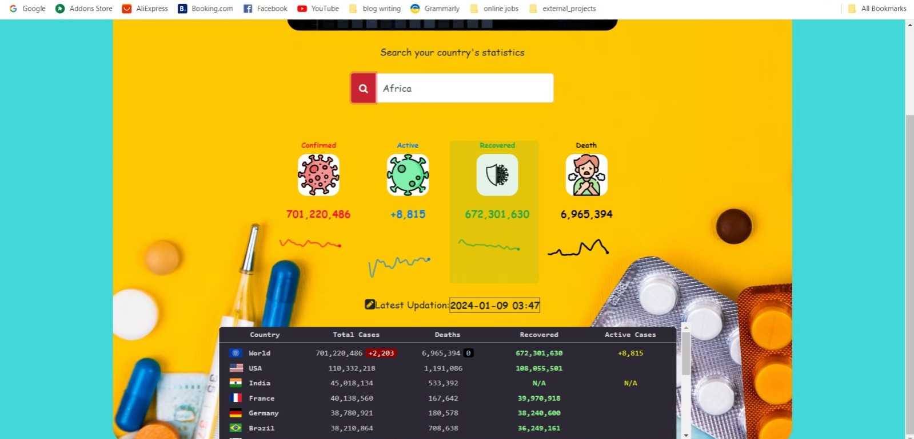
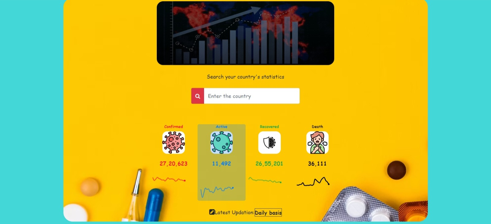
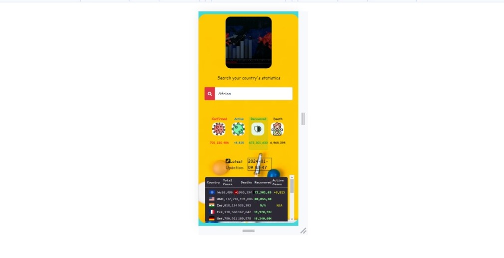

<h1>Covid-19 Statistics</h1>

  <h3>Corona api</h3> Gives the confirmed,recovered & death statistics bases on each country.
<h3>Async & await</h3> 
async ad await method used to wait for the fetch() process to end and used that response as input to the next process.
when using await in async function it wont go next process until that it doesn't go for another process

<h3>Html&css Transitions effort</h3> Here i achieved simple transition efforts using (transition & transform)
 
<h3>Faced Challenges</h3>

It was challenging for me to achieve the transition effect while clicking the div(confirmed, recovered,active,death)
tried out different way of approach. It forced me to make a lot of effort.

  
<h3>Learned & Used</h3>
<ul>
    <li>Div positioning (absolute)</li>
    <li>Some animation efforts</li>
    <li>Css properties to the core</li>
    <li>Bootstrap Responsive(mobile responsive)</li>
    <li>Transition effects</li>
    <li>iframe</li>
  </ul>
<h2>And my output will be with responsivnes</h2>

